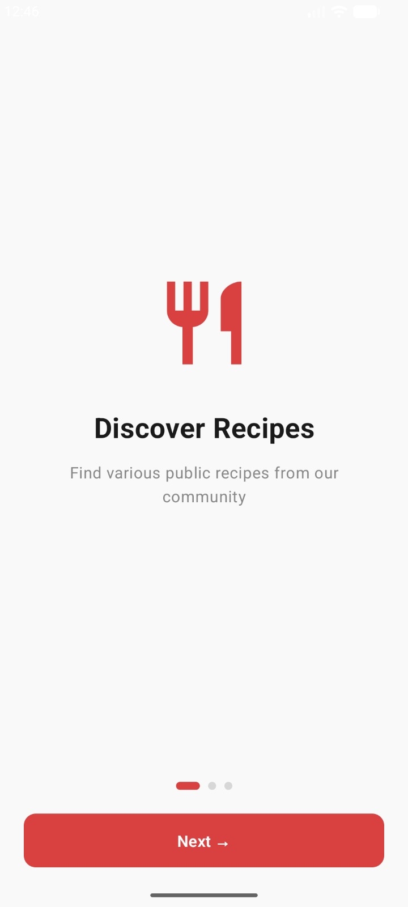
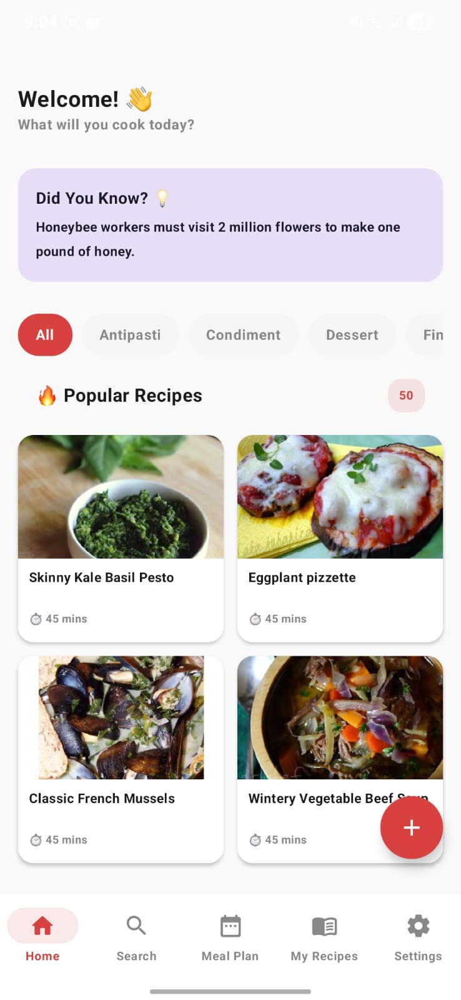
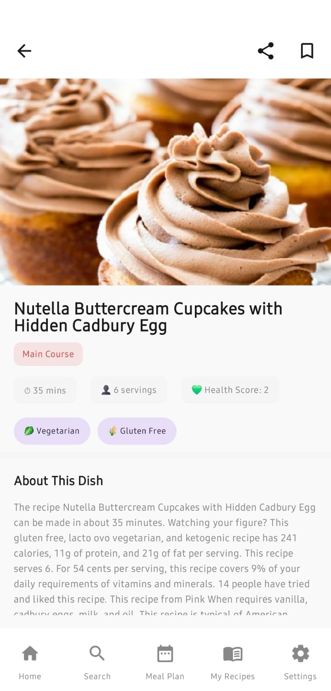
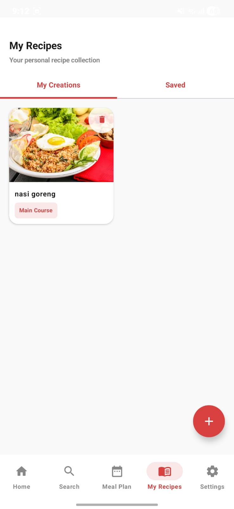
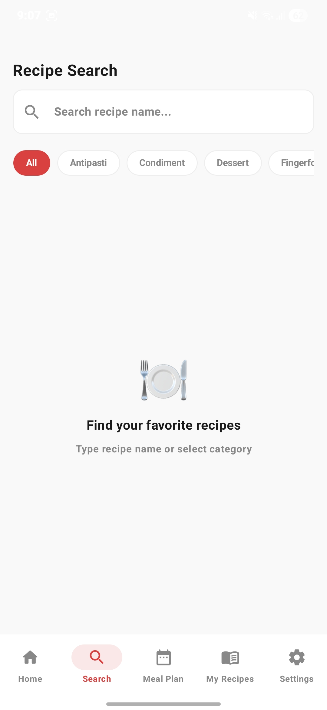
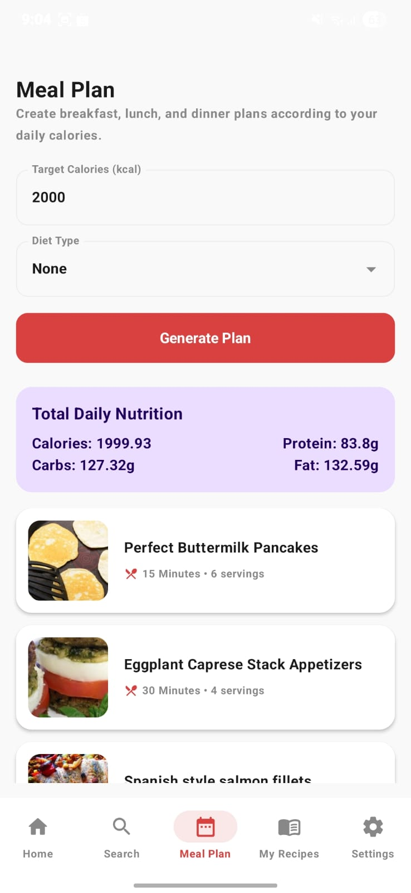
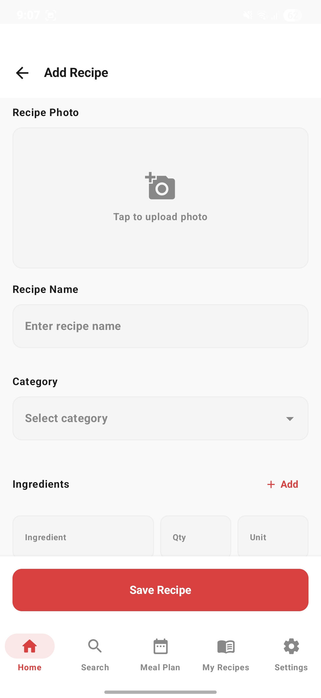
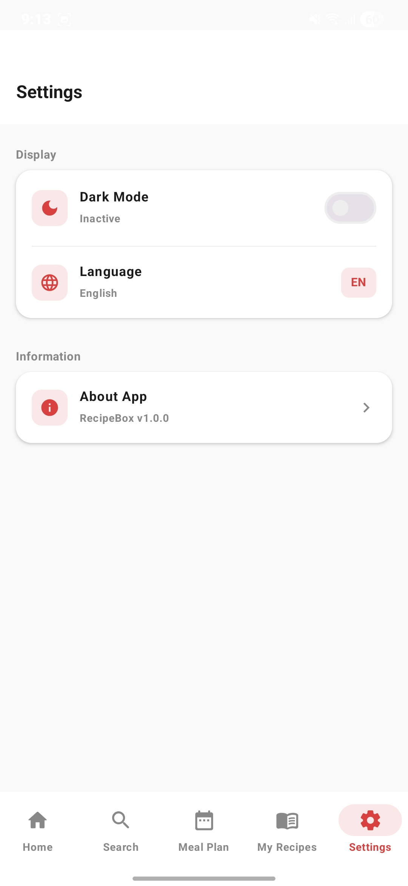

# 🍳 Recipe Box

**Recipe Box** adalah aplikasi Android yang menjadi asisten kuliner pribadi Anda. Temukan resep baru dari seluruh dunia, simpan resep favorit, buat rencana makan harian, dan nikmati pengalaman memasak yang lebih mudah dan menyenangkan.

Dibangun dengan arsitektur **MVVM + Clean Architecture**, menggunakan **Jetpack Compose** sebagai UI toolkit modern, dan didukung oleh **Spoonacular API** sebagai sumber data resep.

---

## 📸 Screenshot Aplikasi

| Onboarding | Beranda (Home) | Detail Resep | Resep Saya |
|:---:|:---:|:---:|:---:|
|  |  |  |  |

| Pencarian | Meal Plan | Tambah Resep | Pengaturan |
|:---:|:---:|:---:|:---:|
|  |  |  |  |

---

## ✨ Penjelasan Fitur

### 🎬 Onboarding (Layar Sambutan)
Saat pengguna **pertama kali** membuka aplikasi, mereka akan disambut oleh 3 layar perkenalan yang bisa digeser (swipe). Setiap layar menjelaskan keunggulan utama aplikasi:
1. **Discover Recipes** — Jelajahi ribuan resep dari seluruh dunia.
2. **Save Your Recipes** — Simpan dan kelola koleksi resep pribadi.
3. **Cook Anywhere** — Akses resep secara offline kapan saja, di mana saja.

Layar onboarding ini **hanya muncul sekali**. Setelah pengguna menyelesaikannya, status tersebut disimpan di `DataStore Preferences` sehingga tidak akan muncul lagi di pembukaan berikutnya.

---

### 🏠 Home (Beranda)
Halaman utama yang menjadi pusat inspirasi memasak. Berikut rincian setiap elemennya:

- **Banner Food Trivia ("Did You Know?")** — Di bagian atas beranda, terdapat kartu fakta unik seputar makanan yang diambil secara acak dari endpoint `/food/trivia/random`. Jika bahasa aplikasi diatur ke Bahasa Indonesia, teks trivia akan **diterjemahkan secara otomatis** menggunakan Google ML Kit (terjemahan dilakukan langsung di perangkat, tanpa perlu internet setelah model bahasa diunduh). Jika API gagal, sistem menampilkan trivia cadangan (fallback) dari `strings.xml`.
- **Chip Filter Kategori** — Deretan tombol kategori horizontal (All, Main Course, Dessert, Side Dish, Appetizer, Salad, Beverage, dll) yang memungkinkan pengguna menyaring daftar resep berdasarkan jenis masakan yang diinginkan.
- **Grid Resep Populer** — Menampilkan hingga **50 resep acak** dalam format grid 2 kolom yang diambil dari Spoonacular API. Setiap kartu resep menampilkan foto masakan, nama resep, serta estimasi waktu memasak. Data resep ini **di-cache ke Room Database** secara otomatis, sehingga jika pengguna membuka aplikasi tanpa koneksi internet, daftar resep terakhir tetap bisa ditampilkan.
- **Tombol Tambah (+)** — Floating Action Button di sudut kanan bawah yang menjadi jalan pintas untuk langsung membuat resep baru.

---

### 🔍 Search (Pencarian)
Halaman pencarian yang dirancang untuk menemukan resep secara cepat dan akurat:

- **Pencarian Real-Time** — Pengguna cukup mengetikkan nama resep di bilah pencarian, dan hasil akan langsung muncul secara instan saat mengetik (tanpa perlu menekan tombol cari). Pencarian dilakukan ke endpoint `/recipes/complexSearch` menggunakan Retrofit.
- **Filter Kategori** — Sama seperti di beranda, deretan chip kategori tersedia untuk mempersempit hasil pencarian. Pengguna bisa menggabungkan kata kunci dengan kategori tertentu.
- **Jumlah Hasil** — Di bawah bilah pencarian, sistem menampilkan jumlah total resep yang ditemukan (contoh: "12 recipes found").
- **Empty State** — Jika belum ada pencarian, ditampilkan ilustrasi informatif dengan teks "Find your favorite recipes" beserta panduan singkat. Jika pencarian tidak menemukan hasil, ditampilkan teks "Recipe not found" disertai saran untuk mencoba kata kunci lain.

---

### 📅 Meal Plan (Rencana Makan Harian)
Fitur asisten nutrisi otomatis yang membantu pengguna merencanakan menu harian:

- **Input Target Kalori** — Pengguna memasukkan target kalori harian yang diinginkan (contoh: 2000 kkal). Ini akan menjadi acuan bagi sistem untuk menghitung pembagian nutrisi di setiap waktu makan.
- **Pilihan Tipe Diet** — Tersedia dropdown menu dengan berbagai opsi diet: None (tanpa batasan), Vegetarian, Vegan, Gluten Free, Ketogenic, Paleo, dan lainnya.
- **Tombol Generate Plan** — Setelah pengguna menekan tombol ini, sistem mengirim request ke endpoint `/mealplanner/generate` dari Spoonacular API. Hasil yang ditampilkan mencakup:
  - **Total Nutrisi Harian** — Kartu ringkasan yang menampilkan total Kalori, Protein, Karbohidrat, dan Lemak dari seluruh resep yang direkomendasikan.
  - **3 Rekomendasi Resep** — Satu resep untuk sarapan, satu untuk makan siang, dan satu untuk makan malam. Setiap kartu menampilkan foto, nama resep, estimasi waktu memasak, dan jumlah porsi. Kartu bisa ditekan untuk masuk ke halaman detail resep tersebut.

---

### 📝 Detail Resep
Halaman yang menampilkan informasi resep secara lengkap dan mendetail. Terdapat dua jenis halaman detail:

**A. Detail Resep Publik (dari API)**
- **Gambar Resep** — Foto masakan berkualitas tinggi yang dimuat menggunakan Coil Image Loader dengan caching otomatis.
- **Info Ringkas** — Chip kecil yang menampilkan estimasi waktu memasak (menit), jumlah porsi, dan skor kesehatan (Health Score).
- **Tentang Hidangan** — Deskripsi singkat mengenai masakan, asal-usul, dan karakteristiknya. Teks ini otomatis **diterjemahkan ke Bahasa Indonesia** jika pengaturan bahasa aktif menggunakan ML Kit Translation.
- **Bahan-bahan (Ingredients)** — Daftar lengkap bahan masakan beserta takaran. Data ini diambil dari response API `extendedIngredients` dan **di-cache ke Room Database** agar tetap tersedia saat offline.
- **Langkah Memasak (Cooking Steps)** — Instruksi memasak yang dipecah menjadi langkah-langkah bernomor. Sistem menggunakan logika **smart parsing** (`getSmartInstructionsString()`) yang mampu memproses berbagai format instruksi dari API (baik yang sudah terstruktur maupun yang masih berbentuk paragraf panjang) dan menyajikannya dalam format yang rapi dan mudah dibaca.
- **Informasi Gizi (Nutrition Info)** — Rincian kandungan gizi per porsi: Kalori, Lemak, Karbohidrat, dan Protein.
- **Label Diet** — Indikator visual yang menunjukkan apakah resep tersebut Vegetarian, Vegan, Gluten Free, atau Dairy Free.
- **Tombol Bookmark** — Ikon di bagian atas yang memungkinkan pengguna menyimpan resep ke daftar favorit lokal (Room Database) sehingga bisa diakses kapan saja tanpa internet.
- **Tombol Share** — Membagikan resep ke aplikasi lain (WhatsApp, Telegram, dll) melalui mekanisme Android Intent Share, mengirimkan nama dan link resep.

**B. Detail Resep Pribadi (dari Room Database)**
- Menampilkan informasi yang sama seperti di atas, namun data diambil dari penyimpanan lokal perangkat.
- Terdapat tombol **Edit** (ikon pensil) untuk mengubah resep dan tombol **Hapus** (ikon tempat sampah) dengan dialog konfirmasi ganda agar pengguna tidak secara tidak sengaja menghapus resepnya.

---

### 📖 My Recipes (Resep Saya)
Perpustakaan resep luring (offline) milik pengguna, dibagi menjadi dua tab:

**Tab "Buatan Sendiri" (My Creations)**
- Menampilkan semua resep yang dibuat langsung oleh pengguna melalui formulir.
- Setiap kartu resep memiliki ikon **hapus** (🗑️) di sudut kanan atas untuk penghapusan cepat.
- Menekan kartu akan membuka halaman Detail Resep Pribadi (bisa diedit dan dihapus).

**Tab "Tersimpan" (Saved)**
- Menampilkan resep publik dari API yang telah di-bookmark oleh pengguna.
- Resep tersimpan ini telah di-cache secara penuh (termasuk bahan-bahan dan langkah memasak), sehingga **tetap bisa dibuka meskipun tanpa koneksi internet**.

**Formulir Tambah / Edit Resep**
- **Upload Foto** — Pengguna bisa memilih foto dari galeri atau mengambil langsung dari kamera perangkat. Foto disimpan di penyimpanan internal aplikasi.
- **Nama Resep** — Kolom teks wajib diisi, dengan validasi agar tidak boleh kosong.
- **Kategori** — Dropdown menu untuk memilih kategori resep (Main Course, Dessert, dll).
- **Waktu Memasak & Porsi** — Kolom input yang telah mendukung lokalisasi penuh (tampil dalam Bahasa Indonesia atau Inggris sesuai pengaturan).
- **Bahan-bahan (Dinamis)** — Pengguna bisa menambah baris bahan secara tak terbatas. Setiap baris berisi kolom Nama Bahan, Jumlah, dan Satuan. Baris bisa dihapus secara individual.
- **Langkah Memasak (Dinamis)** — Sama seperti bahan, pengguna bisa menambah langkah instruksi tanpa batas dan menghapusnya secara individual.
- **Validasi** — Sistem melakukan pengecekan sebelum menyimpan: nama resep wajib diisi, kategori wajib dipilih, dan semua kolom bahan serta langkah tidak boleh ada yang kosong. Jika ada yang belum lengkap, ditampilkan notifikasi Toast.
- **Navigasi Setelah Simpan** — Setelah berhasil menyimpan, pengguna langsung diarahkan ke halaman **Resep Saya** (bukan kembali ke beranda) agar bisa langsung memverifikasi bahwa resep berhasil tersimpan.

---

### ⚙️ Settings (Pengaturan)
Pusat kendali personalisasi aplikasi:

- **Dark Mode** — Toggle switch untuk mengaktifkan atau menonaktifkan mode gelap. Perubahan tema langsung diterapkan ke seluruh halaman secara instan, termasuk warna Status Bar perangkat yang otomatis menyesuaikan. Preferensi tema disimpan secara persisten di `DataStore`, sehingga tetap terjaga saat aplikasi ditutup dan dibuka kembali.
- **Bahasa (Language)** — Tombol untuk beralih antara **English** dan **Bahasa Indonesia**. Pergantian bahasa dilakukan secara instan tanpa perlu restart aplikasi. Sistem menggunakan `AppCompatDelegate.setApplicationLocales()` untuk menerapkan perubahan locale pada seluruh teks UI yang telah didefinisikan di `strings.xml` (untuk English) dan `strings.xml (values-in)` (untuk Bahasa Indonesia). Seluruh teks, termasuk label formulir, pesan error, placeholder, dan notifikasi Toast, ikut berubah sesuai bahasa yang dipilih.
- **Tentang Aplikasi** — Menampilkan versi rilis aplikasi (RecipeBox v1.0.0) beserta daftar teknologi utama yang digunakan dalam pengembangan.

---

## 🛠️ Cara Instalasi

### Prasyarat
- **Android Studio** Ladybug atau lebih baru
- **JDK 11** atau lebih baru
- **Android SDK** dengan API Level 24+ (minimum) dan 36 (target)
- **Koneksi internet** untuk mengambil resep dari API

### Langkah-langkah

1. **Clone repository**
   ```bash
   git clone https://github.com/daka69/RecipeBox.git
   cd recipe-box
   ```

2. **Dapatkan API Key dari Spoonacular**
   - Kunjungi [https://spoonacular.com/food-api](https://spoonacular.com/food-api)
   - Daftar akun gratis dan dapatkan API Key
   - API gratis memberikan **150 requests/hari**

3. **Konfigurasi API Key**

   Buka file `local.properties` di root project dan tambahkan:
   ```properties
   SPOONACULAR_API_KEYS=your_api_key_here
   ```

   > **Tips:** Untuk mendukung rotasi API Key otomatis saat kuota habis, Anda bisa menambahkan beberapa key yang dipisahkan koma:
   > ```properties
   > SPOONACULAR_API_KEYS=key1,key2,key3
   > ```

4. **Sync Gradle**

   Buka project di Android Studio dan klik **"Sync Now"** saat muncul notifikasi.

5. **Build project**
   ```bash
   ./gradlew assembleDebug
   ```

---

## ▶️ Cara Menjalankan Aplikasi

### Via Android Studio
1. Buka project di Android Studio
2. Pilih **device** atau **emulator** (minimum API 24 / Android 7.0)
3. Klik tombol **Run ▶** atau tekan `Shift + F10`

### Via Command Line
```bash
# Build dan install ke perangkat yang terhubung
./gradlew installDebug

# Atau build APK saja
./gradlew assembleDebug
# APK tersedia di: app/build/outputs/apk/debug/app-debug.apk
```

---

## 🌐 Informasi API yang Digunakan

Aplikasi ini menggunakan **[Spoonacular Food API](https://spoonacular.com/food-api)** sebagai sumber data utama.

| Endpoint | Method | Deskripsi |
|----------|--------|-----------|
| `/recipes/random` | GET | Mengambil resep acak (default: 50 resep) |
| `/recipes/{id}/information` | GET | Detail resep berdasarkan ID, termasuk informasi nutrisi |
| `/recipes/complexSearch` | GET | Pencarian resep berdasarkan query dan filter |
| `/food/trivia/random` | GET | Mengambil trivia/fakta menarik tentang makanan |
| `/mealplanner/generate` | GET | Generate rencana makan harian berdasarkan kalori dan diet |

### Autentikasi
- API Key ditambahkan otomatis ke setiap request melalui **OkHttp Interceptor**.
- Mendukung **rotasi API Key otomatis** jika satu key kehabisan kuota (HTTP 402).
- API Key disimpan di `local.properties` dan diakses melalui `BuildConfig` (tidak ter-commit ke Git).

### Base URL
```
https://api.spoonacular.com/
```

---

## 🏗️ Struktur Arsitektur Aplikasi

Aplikasi ini mengikuti pola **MVVM (Model-View-ViewModel)** dengan prinsip **Clean Architecture** yang membagi kode menjadi 3 layer utama:

```
┌─────────────────────────────────────────────────┐
│                 UI Layer (View)                  │
│  ┌───────────┐ ┌───────────┐ ┌───────────────┐  │
│  │  Screens  │ │Components │ │  Navigation   │  │
│  │ (Compose) │ │(Reusable) │ │   (NavHost)   │  │
│  └─────┬─────┘ └───────────┘ └───────────────┘  │
│        │                                         │
│  ┌─────▼──────────────────────────────────────┐  │
│  │         Presentation Layer                 │  │
│  │  ┌──────────┐ ┌──────────┐ ┌────────────┐  │  │
│  │  │  Home    │ │MyRecipes │ │  Detail    │  │  │
│  │  │ViewModel│ │ViewModel │ │ ViewModel  │  │  │
│  │  └────┬─────┘ └────┬─────┘ └─────┬──────┘  │  │
│  │       │            │             │          │  │
│  │  ┌────▼────┐ ┌─────▼───┐ ┌──────▼──────┐   │  │
│  │  │Settings │ │MealPlan │ │  UiState    │   │  │
│  │  │ViewModel│ │ViewModel│ │(Sealed Class│   │  │
│  │  └─────────┘ └─────────┘ └─────────────┘   │  │
│  └─────────────────────┬──────────────────────┘  │
│                        │                         │
├────────────────────────┼─────────────────────────┤
│               Domain Layer                       │
│  ┌─────────────┐ ┌────▼────────┐ ┌───────────┐  │
│  │   Models    │ │  Use Cases  │ │Repository │  │
│  │ (Recipe,    │ │ (10 total)  │ │(Interface)│  │
│  │ RecipeDetail│ │             │ │           │  │
│  │ MealPlan)   │ │             │ │           │  │
│  └─────────────┘ └─────────────┘ └───────────┘  │
│                                                  │
├──────────────────────────────────────────────────┤
│                 Data Layer                       │
│  ┌──────────┐  ┌──────────┐  ┌────────────────┐ │
│  │ Retrofit │  │   Room   │  │  Translation   │ │
│  │  (API)   │  │(Database)│  │  (ML Kit)      │ │
│  └──────────┘  └──────────┘  └────────────────┘ │
│  ┌──────────────────────────────────────────┐    │
│  │     RecipeRepositoryImpl                 │    │
│  │  (Single source of truth)                │    │
│  └──────────────────────────────────────────┘    │
└──────────────────────────────────────────────────┘
```

### Struktur Folder

```
app/src/main/java/com/example/recipebox/
├── MainActivity.kt                  # Entry point, inject ViewModels
├── RecipeBoxApplication.kt          # Hilt Application class
│
├── data/                            # DATA LAYER
│   ├── api/                         # API Service interface (Retrofit)
│   ├── remote/                      # Retrofit client & response DTOs
│   ├── local/                       # Room Entity, DAO, Converters, DataStore
│   ├── database/                    # Room Database & Migrations
│   ├── mapper/                      # Entity ↔ Domain mappers
│   ├── repository/                  # RecipeRepositoryImpl
│   └── translation/                 # ML Kit TranslationService
│
├── domain/                          # DOMAIN LAYER
│   ├── model/                       # Data classes (Recipe, RecipeDetail, MealPlan, dll)
│   ├── repository/                  # RecipeRepository interface
│   └── usecase/                     # 10 Use Cases (GetPublicRecipes, AddRecipe, dll)
│
├── presentation/                    # PRESENTATION LAYER
│   └── viewmodel/                   # 5 ViewModels + UiState sealed class
│
├── di/                              # Hilt Dependency Injection module
│
└── ui/                              # UI LAYER
    ├── screens/                     # 9 Composable screens
    ├── components/                  # Reusable UI components
    ├── navigation/                  # Screen sealed class (routes)
    ├── state/                       # UI state holders (IngredientInput, StepInput)
    └── theme/                       # Material 3 theme, colors, typography
```

### Teknologi yang Digunakan

| Teknologi | Versi | Fungsi |
|-----------|-------|--------|
| **Kotlin** | 2.0.21 | Bahasa pemrograman utama |
| **Jetpack Compose** | BOM latest | UI toolkit deklaratif modern |
| **Material 3** | Latest | Design system & komponen UI |
| **Hilt (Dagger)** | 2.51.1 | Dependency Injection |
| **Room** | 2.7.0 | Local database (SQLite) |
| **Retrofit** | 2.11.0 | HTTP client untuk REST API |
| **Gson** | 2.11.0 | JSON serialization/deserialization |
| **Coil** | 2.6.0 | Image loading & caching |
| **Navigation Compose** | 2.7.7 | In-app navigation |
| **DataStore** | 1.1.1 | Penyimpanan preferensi (dark mode, bahasa) |
| **ML Kit Translate** | 17.0.3 | Terjemahan on-device (EN → ID) |
| **Coroutines** | Latest | Asynchronous programming |

---

## ✅ Fitur Wajib

| # | Fitur Wajib | Status | Keterangan |
|---|-------------|--------|------------|
| 1 | **Menampilkan daftar resep** dari API | ✅ | 50 resep acak dari Spoonacular, dengan filter kategori |
| 2 | **Detail resep** (bahan, langkah, nutrisi) | ✅ | Informasi lengkap termasuk gizi, skor kesehatan, dan label diet |
| 3 | **Pencarian resep** | ✅ | Pencarian real-time berdasarkan nama dan kategori |
| 4 | **Simpan resep** ke lokal (bookmark) | ✅ | Toggle bookmark untuk resep API, tersimpan di Room database |
| 5 | **CRUD resep personal** | ✅ | Tambah, lihat, edit, dan hapus resep buatan sendiri |
| 6 | **Arsitektur MVVM** | ✅ | 5 ViewModel terpisah sesuai Single Responsibility Principle |
| 7 | **Penggunaan API eksternal** | ✅ | Spoonacular API dengan 5 endpoint berbeda |

---

## 🌟 Fitur Tambahan

| # | Fitur Tambahan | Keterangan |
|---|---------------|------------|
| 1 | **Meal Plan Generator** | Generate rencana makan harian otomatis berdasarkan target kalori dan tipe diet |
| 2 | **Terjemahan Otomatis (ML Kit)** | Terjemahan on-device EN→ID untuk detail resep dan trivia, tanpa perlu koneksi internet setelah model diunduh |
| 3 | **Dukungan Multi-Bahasa** | UI mendukung Bahasa Indonesia dan English, dapat diganti secara instan dari Settings |
| 4 | **Dark Mode** | Toggle dark mode yang tersimpan persisten di DataStore |
| 5 | **Onboarding Screen** | Layar sambutan dengan 3 slide informatif untuk pengguna baru |
| 6 | **Offline Caching** | Resep API di-cache ke Room database, tetap bisa diakses tanpa internet |
| 7 | **Share Resep** | Membagikan resep ke aplikasi lain melalui Intent Share |
| 8 | **Deep Link** | Navigasi langsung ke detail resep via URI `recipebox://detail/{recipeId}` |
| 9 | **Upload Foto Resep** | Pilih foto dari galeri atau ambil langsung dari kamera untuk resep personal |
| 10 | **API Key Rotation** | Rotasi otomatis ke API key cadangan saat kuota key utama habis (HTTP 402) |
| 11 | **Food Trivia** | Fakta menarik tentang makanan ditampilkan di beranda, dengan terjemahan otomatis |
| 12 | **Clean Architecture** | Pemisahan layer (Data, Domain, Presentation, UI) dengan Dependency Injection via Hilt |

---

## 📄 Lisensi

Proyek ini dibuat untuk keperluan akademis.

---

<p align="center">
  Dibuat dengan ❤️ menggunakan <b>Kotlin</b> dan <b>Jetpack Compose</b>
</p>
